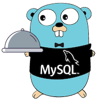
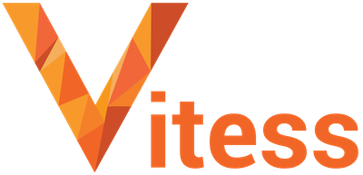

# Architecture

olt is the world's first version controlled SQL database.

How would you build a version controlled SQL database? This article will start with some of the high level requirements, explain some possible architecture options, and then explain the actual building blocks used to build Dolt. 

# Requirements

Dolt started with the idea that data was too hard to share. "Share" is a loaded word here. Share in this context means distribute, collaborate on, change, buy, and sell. 

Most data was and still is shared as comma separated value (CSV) files. CSVs are easy to build and consume but hard to change. If you need to modify data distributed as a CSV, it becomes a pain to merge those changes back into the "main" copy. You can do it with a tool like Git but the rows and columns must be sorted in the same way as you received them or you will get nonsensical diffs and merge conflicts. 

We thought if we added diff, branch, and merge to data in some way, data would be easier to share. The standard for diff, branch, and merge is Git. We wanted to mimic the Git model of version control for data because almost every developer is at least passingly familiar with Git.

The more complicated the data, the harder sharing becomes. CSVs map to individual tables. Databases have multiple tables, schema, and constraints to ensure quality of complicated data. Sharing CSVs sacrifices all these tools. You have a collection of files and it is up to you to interpret them. As we got deeper into the data sharing problem, we realized modern databases worked well managing complicated data. We decided the form of data people should share was databases, not tables. Dolt needed to be a full fledged, modern SQL relational database with schema, constraints, and powerful query capabilities in addition to Git-style version control capabilities.

Much farther along on the journey of building Dolt we realized a version controlled database was a generally useful tool beyond data sharing. Now, Dolt is used to power reproducible models, add version control to an application, provide audit history of sensitive data, or as a version controlled replica of an existing database. Dolt can be used instead of or in addition to your existing database for powerful version control features like diff, branch, and merge, not just to share the data inside it.

So, to recap, to make data sharing easier, we needed a modern SQL relational database with version control capabilities in the style of Git. Let's break those two requirements a bit further. 

## SQL Database

### Tables

A SQL database is a collection of tables. Tables have rows and columns. The columns have schema: names, types, and constraints. Columns can have indexes to improve query performance. Advanced database features like views, stored procedures, and triggers would also be useful. Tables must be able to be accessed via standard SQL select, insert, update, and delete queries. We could implement our own flavor of the SQL standard or we could adopt an existing standard. Adopting an existing standard was preferable so all the tools that work with that standard would also work with Dolt.

### Performance at Scale

A modern relational database must be performant at large scale. In particular, sub-linear worst case scaling on seek (ie. select) is a must. 

### Concurrent Access

Modern databases support concurrent access via multiple clients. Dolt could work like SQLite and provide concurrent access directly to storage via a library. Or Dolt could work like Postgres or MySQL providing a server and concurrent access via clients over a network connection. We preferred the Postgres or MySQL model because it seemed more popular.

## Version Control

### Storage Compression

To offer version control in a database, all versions of the data must be stored. Storing a full copy of the database at every change is untenable. Data that does not change between versions must share storage.

### Fast diff

Comparing and producing the differences between two versions must be fast. Displaying diffs to a user is a common operation. Querying diffs must also be supported and should be as fast as a regular select query. Moreover, merge relies on diffs so fast diff is essential for merge operations at scale.

### Single Program

We also wanted to mimic the Git command line interface but for data. Git is intended to be used in a decentralized manner. Every user has a copy of Git and the files Git is operating on on their local machine. We wanted to keep this model with Dolt. So, we wanted Dolt to be a single, easily installed program. 

# Where we Started

In order to satisfy the version control requirements of storage compression and fast diff, we knew we would need our own storage engine. There was no way to adapt standard B-tree based database storage engines to the version control task.

Could Git be adapted to be a storage engine for a database? [Other people have tried](https://www.dolthub.com/blog/2021-11-26-so-you-want-git-database/#using-git-as-a-database). Git storage is not built for fast seek. You really need something close to a B-tree with special version control properties for your storage engine.

To achieve the SQL database requirements, we looked at the most popular open source options: MySQL and Postgres. Both [MySQL](https://dev.mysql.com/doc/refman/8.0/en/storage-engines.html) and [Postgres](https://www.dolthub.com/blog/2022-01-26-creating-a-postgres-foreign-data-wrapper/) have pluggable storage engines. But how would we access the version control properties of the storage engine? We needed more control over the supported SQL dialect than MySQL or Postgres exposed.

# Oh God. You built a SQL database from scratch?!?

Not really. We leveraged three existing open source packages: 

1. [Noms](https://github.com/attic-labs/noms) for version controlled storage.
2. [go-mysql-server](https://github.com/dolthub/go-mysql-server) for our SQL engine.
3. [Vitess](https://github.com/dolthub/vitess) for MySQL compatible parsing and serving.

Dolt itself implements all the glue code to stitch these three open source projects into world's first version controlled SQL database. As you can see there is no Git or MySQL code in Dolt though Dolt implements Git and MySQL interfaces.

We've been working on Dolt since 2018. We've forked and heavily modified all three of these packages since to fit our use case. Our forks are [also open source](https://github.com/dolthub).

## Noms

[Noms](https://github.com/attic-labs/noms) pioneered a data storage engine with Git properties. Noms built a content-addressed B-tree called a [Prolly tree](https://docs.dolthub.com/architecture/storage-engine/prolly-tree) that had seek performance characteristics of a B-tree but also provided fast diff. You could stick the root content addresses of Prolly trees in a Merkle DAG to achieve versioning similar to Git with shared storage across versions.

Noms was implemented in Golang. Dolt was implemented in Golang to take advantage of Noms work. Additionally, Golang is compiled so we could ship Dolt as a single program, satisfying that requirement.

We initially worked on a fork of Noms to build Dolt. [The Noms team had moved on](https://techcrunch.com/2018/01/08/salesforce-acquires-attic-labs-the-startup-behind-decentralized-database-noms/) when we started to use it. Our code became so intertwined that managing Noms as a dependency became messy so we included Noms code [directly in the Dolt repository](https://github.com/dolthub/dolt/tree/main/go/store).

We heavily modified Noms to fit the SQL database use case. We kept the Noms model but traded the flexibility of Noms for throughput in our more specific SQL database use case. Optimizing for this specific use case allowed us to increase performance by an order of magnitude.

## `go-mysql-server`

Originally developed by [src-d](https://github.com/src-d), [`go-mysql-server`](https://github.com/dolthub/go-mysql-server) is a pure Golang embeddable SQL engine. src-d went out of business in 2018 and [with src-d's blessing our fork of `go-mysql-server`](https://www.dolthub.com/blog/2020-05-04-adopting-go-mysql-server/) became the primary `go-mysql-server` project. 

Since we adopted `go-mysql-server`, we have added support for triggers, check constraints, character sets, collations, and many more features. We've also improved join performance and correctness by improving the analyzer. `go-mysql-server` is fast becoming a modern, credible SQL engine.

`go-mysql-server` allowed Dolt full control of the SQL dialect and engine while also allowing Dolt to be a single compiled Golang program. We implemented [custom procedures for version control write operations](https://docs.dolthub.com/sql-reference/version-control/dolt-sql-procedures) and custom [system tables and functions for version control read operations](https://docs.dolthub.com/sql-reference/version-control/dolt-system-tables). No Postgres flavored alternative allowing for this level of control existed so Dolt is MySQL flavored.

Most other users of `go-mysql-server` use it to test their MySQL applications without a running MySQL server. We're the only people we know of intrepid enough to build a full-fledged database on top of it.

## Vitess

Vitess is used by `go-mysql-server` for SQL parsing and serving. We quickly forked it to [remove 90% of the functionality we did not need](https://www.dolthub.com/blog/2020-09-23-vitess-pruning/). We've heavily modified our fork since to support much more SQL syntax.

# Take a Deeper Dive

Continue reading for a deeper dive into the Dolt storage engine and SQL implementation.

1. [The Storage Engine](./storage-engine.md)
2. [The SQL Implementation](./sql.md)

