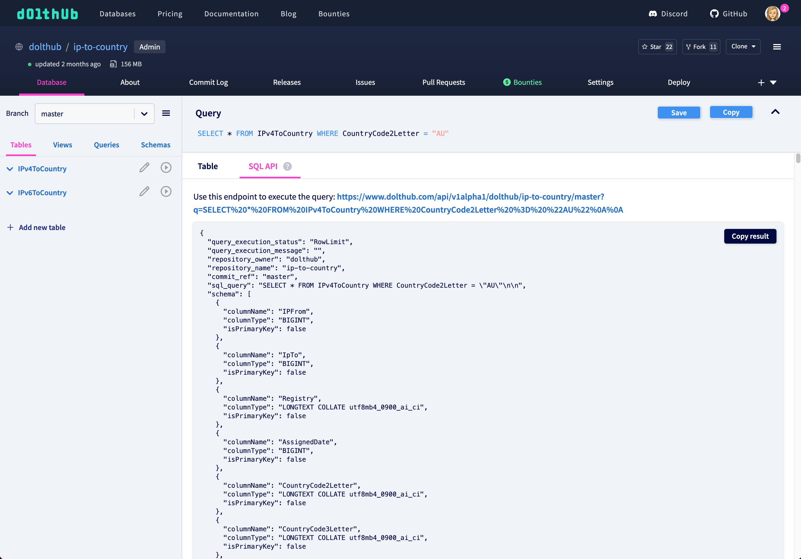
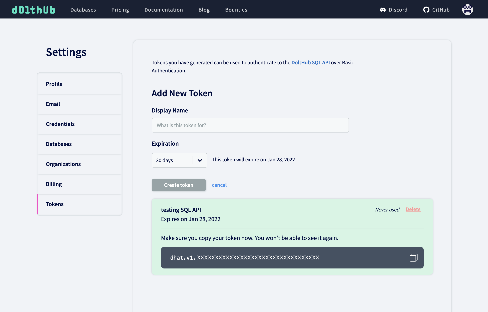

# API

## What is the SQL API?

DoltHub provides an API for accessing Dolt databases via web requests. A Dolt database can be attached to a DoltHub remote and pushed. At that point DoltHub provides an API against which users can execute Dolt SQL with results returned as JSON.

## Example

We will use an example DoltHub database, [dolthub/ip-to-country](https://www.dolthub.com/repositories/dolthub/ip-to-country/) and the Python `requests` library to explore it in the Python console:

```python
import requests
owner, repo = 'dolthub', 'ip-to-country'
res = requests.get('https://dolthub.com/api/v1alpha1/{}/{}'.format(owner, repo))
res.json()
```

This shows our repository metadata as a dictionary:

```text
{'query_execution_status': 'Success',
 'query_execution_message': '',
 'repository_owner': 'dolthub',
 'repository_name': 'ip-to-country',
 'commit_ref': 'master',
 'sql_query': 'SHOW TABLES;',
 'schema': [{'columnName': 'Table',
   'columnType': 'String',
   'isPrimaryKey': False}],
 'rows': [{'Table': 'IPv4ToCountry'}, {'Table': 'IPv6ToCountry'}]}
```

We can now execute a query:

```python
query = '''SELECT * FROM IPv4ToCountry WHERE CountryCode2Letter = "AU"'''
res = requests.get('https://www.dolthub.com/api/v1alpha1/{}/{}/{}'.format(owner, repo, branch), params={'q': query})
res.json()
```

This yields the results as JSON, with both schema and data:

```text
{'query_execution_status': 'RowLimit',
 'query_execution_message': '',
 'repository_owner': 'dolthub',
 'repository_name': 'ip-to-country',
 'commit_ref': 'master',
 'sql_query': 'SELECT * FROM IPv4ToCountry WHERE CountryCode2Letter = "AU"',
 'schema': [{'columnName': 'IPFrom',
   'columnType': 'Int',
   'isPrimaryKey': False},
  {'columnName': 'IpTo', 'columnType': 'Int', 'isPrimaryKey': False},
  {'columnName': 'Registry', 'columnType': 'String', 'isPrimaryKey': False},
  {'columnName': 'AssignedDate', 'columnType': 'Int', 'isPrimaryKey': False},
  {'columnName': 'CountryCode2Letter',
   'columnType': 'String',
   'isPrimaryKey': False},
  {'columnName': 'CountryCode3Letter',
   'columnType': 'String',
   'isPrimaryKey': False},
  {'columnName': 'Country', 'columnType': 'String', 'isPrimaryKey': False}],
 'rows': [{'IPFrom': '16777216',
   'IpTo': '16777471',
   'Registry': 'apnic',
   'AssignedDate': '1313020800',
   'CountryCode2Letter': 'AU',
   'CountryCode3Letter': 'AUS',
   'Country': 'Australia'},
.
.
.
```

As a reminder, this API is in Alpha version, and we will continue to flesh this out, as
well as improve query performance, over time.

You can also explore our SQL API on DoltHub whenever you execute a query:



## Authentication

API tokens can be used to authenticate calls to the SQL API over Basic Authentication.
This is useful for executing SQL queries against private databases.

First, create an API token in your [settings](https://www.dolthub.com/settings/tokens) on DoltHub. Copy the token right away, as you
won't be able to see it again.



Now you can use this token in the header when executing a query against a private database.

```python
owner, repo, branch = "dolthub", "private-db", "main"
query = """SELECT * FROM testtable"""

res = requests.get(
    "https://www.dolthub.com/api/v1alpha1/{}/{}".format(owner, repo, branch),
    params={"q": query},
    headers={ "authorization": "token [TOKEN YOU COPIED]" },
)

res.json()
```

Please note: You must include a ref name when making authenticated calls to the SQL API using a token.
