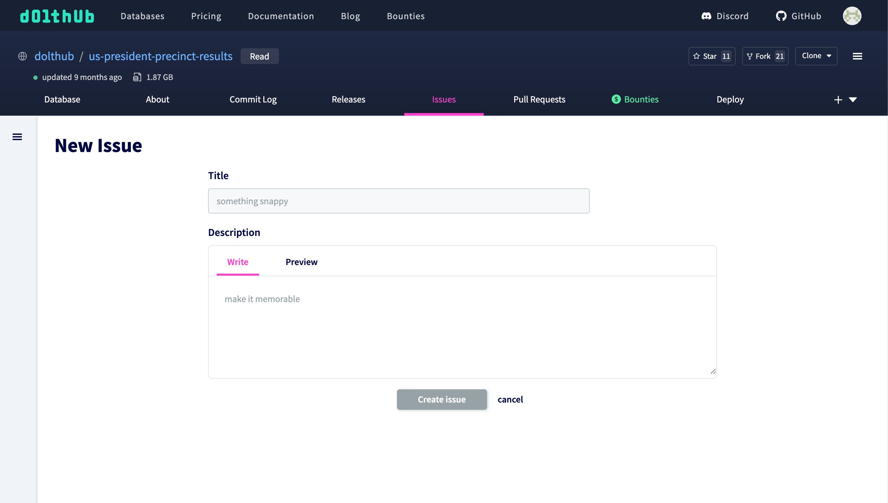
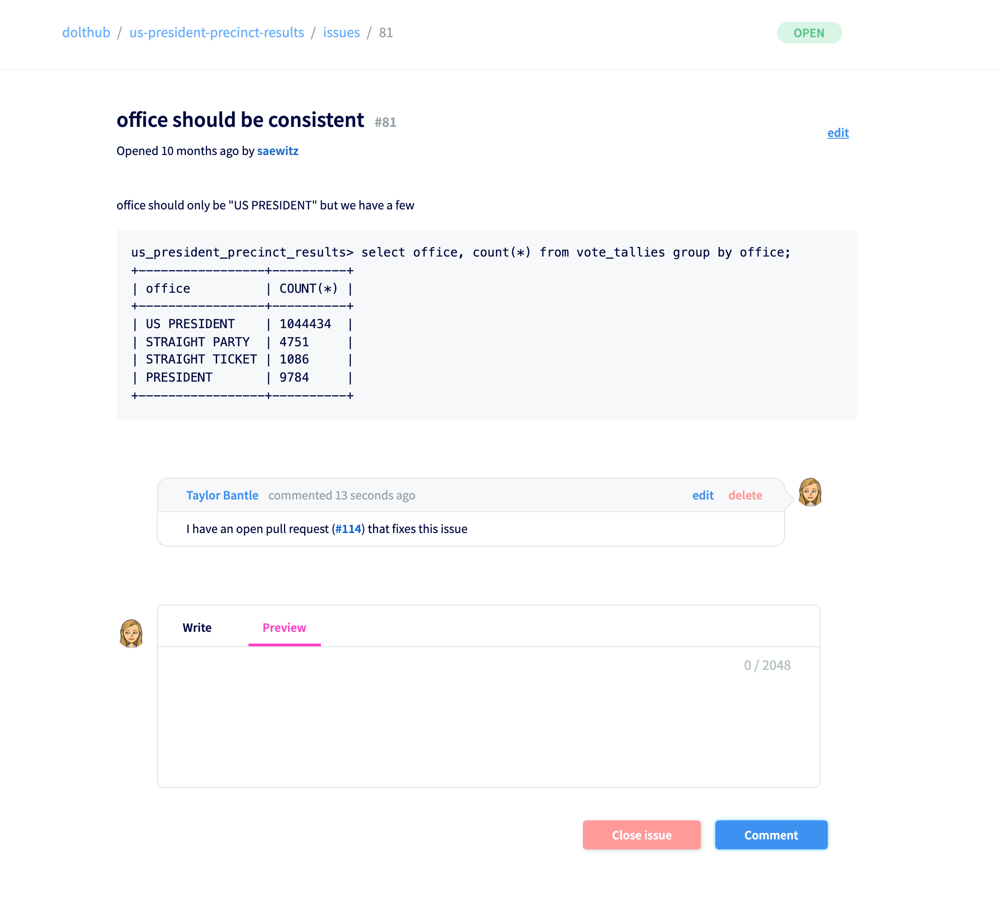

# Issues

## What is an issue?

Issues on DoltHub are a useful management tool that let users track bugs, ask questions, or document any nuances of data.

## How to use issues

DoltHub issues are useful for:

* Tracking future work
* Having open and transparent communication with database owners
* Discussing and fixing potential bugs

## Difference between GitHub issues and DoltHub issues

DoltHub issues are similar to GitHub issues in purpose, but are somewhat simpler in practice. GitHub has some extra features that let's you easily cross-reference issues and [pull requests](prs.md). You can link an issue to a pull request and automatically close the issue when a pull request is merged. In GitHub you are also able to assign issues to users and add labels to issues.

These features are on our DoltHub roadmap.

## Example

We will use our [`dolthub/us-president-precinct-results`](https://www.dolthub.com/repositories/dolthub/us-president-precinct-results) database, which was creating through a [data bounty](https://github.com/dolthub/docs/blob/gitbook-dev/content/introduction/getting-started/data-bounties.md), as an example.

One of the bounty participants noticed some inconsistencies with one of the columns in the `vote_tallies` table. They decided to create an issue to document work that could be done to fix this issue. You can create an issue using the new issue form on any database page.

You notice the issue can be easily fixed, so you run a few SQL queries and create a new [pull request](prs.md) with some changes.

I can let the user who created the issue know that I fixed the issue by commenting on the issue, which notifies the issue creator and any participants in the issue.

Now that this issue has been documented and fixed, anyone who also notices this problem with the data can see the discussion surrounding it, and also view the pull request with the solution. If the owner of the database decides to approve and merge the pull request, the issue can be closed and any participants will be notified that there has been a resolution.
