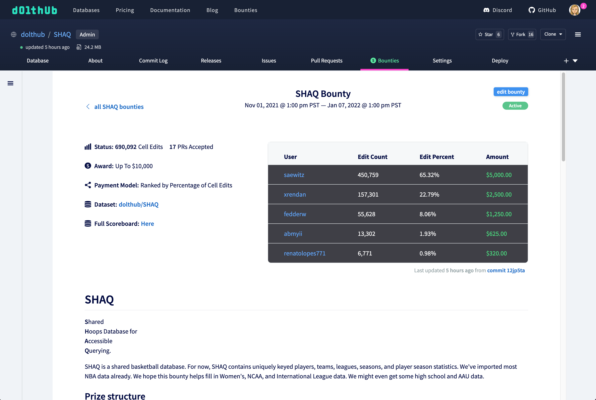
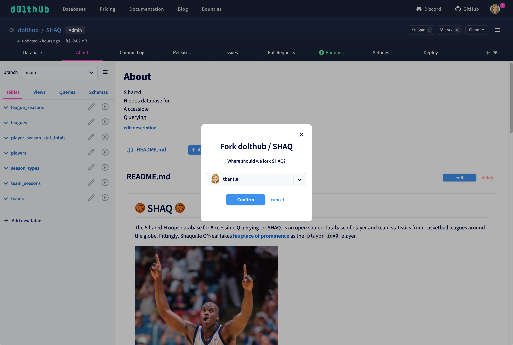
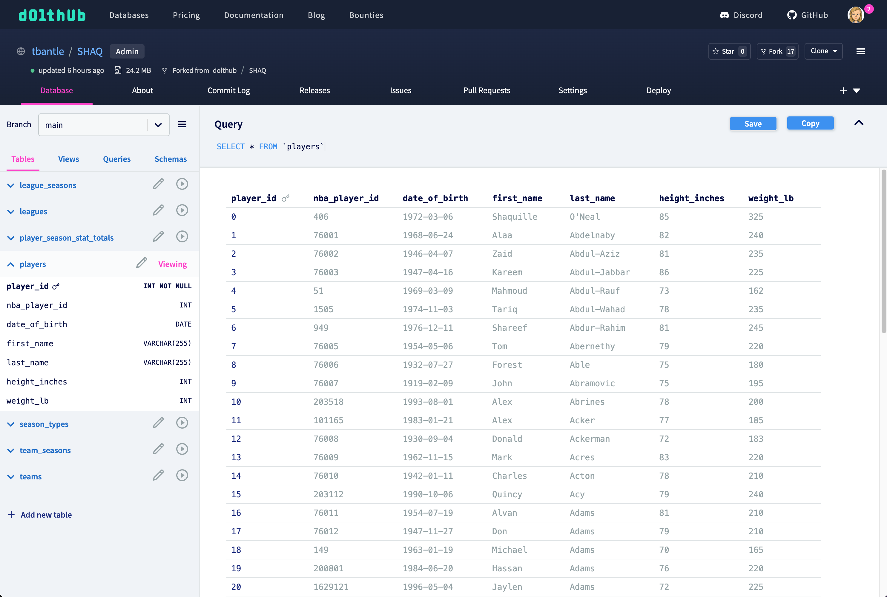
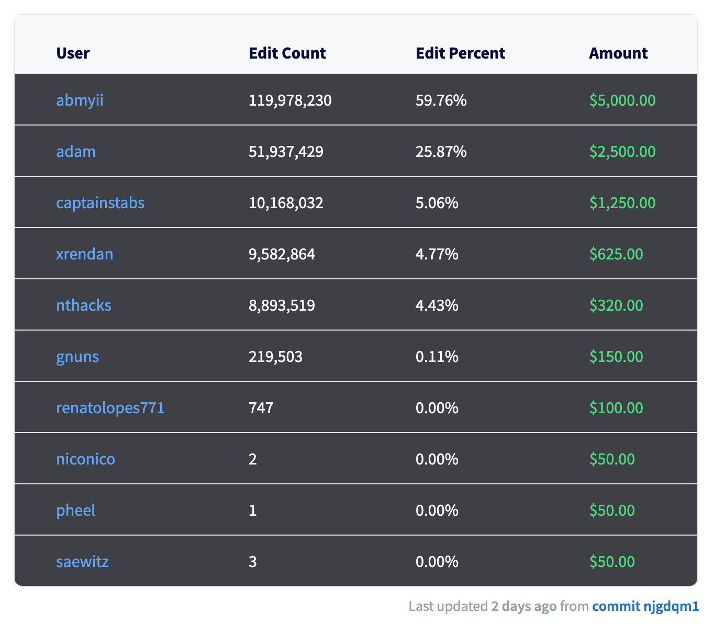

# Bounties

A Data Bounty is a financial reward paid for sourcing all, or part, of a specific dataset. A user or organization can also pay to attach a bounty to a dataset of their choosing. Anyone can get paid for finding the data specified in a bounty.

## Participating

The first thing to do is make sure you have a DoltHub account. Sign up [here](https://www.dolthub.com/signin) if you haven't already.

Once you're logged in, you can easily see the list of available data bounties on your [profile page](https://dolthub.com/profile/bounties):

Let's focus on the `dolthub/SHAQ` bounty. See more details about the bounty and rewards on the [bounty page](https://www.dolthub.com/repositories/dolthub/SHAQ/bounties/d013ac74-9e27-48ee-8d19-02bf7163f230):

If you'd like to capture some of the $10,000 available for gathering basketball data, then it's time to dive into the details on how to participate.

### Fork the Repository

DoltHub uses the "fork" model for facilitating collaboration. Contributions are accepted by making a pull request from your fork. You can read more about DoltHub's collaboration model [here](./dolthub.md#data-collaboration).

For now just fork `dolthub/SHAQ` into your own namespace:

You will then be redirected to the forked database where you can have a look around:

If you want to get paid, you need to add some data, so let's turn to that!

### Writing Data

In order to make a pull request against the bounty database, you need to make some changes in your fork. There are a few ways to do this:

- Use file upload or make changes using the SQL Console on DoltHub (see [docs](getting-started.md#using-dolthub))
- Clone the database and use the command line, SQL, or [Doltpy](https://github.com/dolthub/doltpy) to make changes (see [docs](../getting-started/writing.md))

It doesn't matter how you make changes, as long as they are correct.

### Creating a Pull Request

Once you have pushed a commit with some changes you want to get paid for, create a pull request from the base database, `dolthub/SHAQ`:

Each bounty has specific instructions for submitting a pull request. Make sure you read the instructions and provide sources for your data. Your pull request can be rejected if it is not up to standards.

### Review

The owner of the Data Bounty, in this case DoltHub, will then review your submission. If your pull request is merged you will be able to see the scoreboard on the bounty page updated with your current pay out.

## Creating

If you'd like to create a bounty, please [contact us](https://www.dolthub.com/contact). The bounty process is still a work in progress and is very manual, but we'd love to hear from anyone who is interested in purchasing data this way.

## Transparency

To make the data bounties payout process clear and transparent, our payment calculation code is open source and can be found [here](https://github.com/dolthub/bounties).

When the bounty is over, we will send an email to your primary email address on your DoltHub account to arrange payment. It is important you have access to the email you use to sign up for DoltHub.

## Getting Help

If you need help or have questions, join our [Discord](https://discord.com/invite/RFwfYpu) and talk to us in the \#data-bounties channel. We are excited to welcome new members to our vibrant and growing community!
