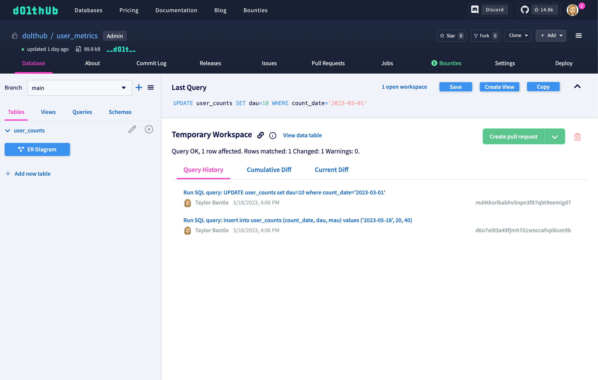
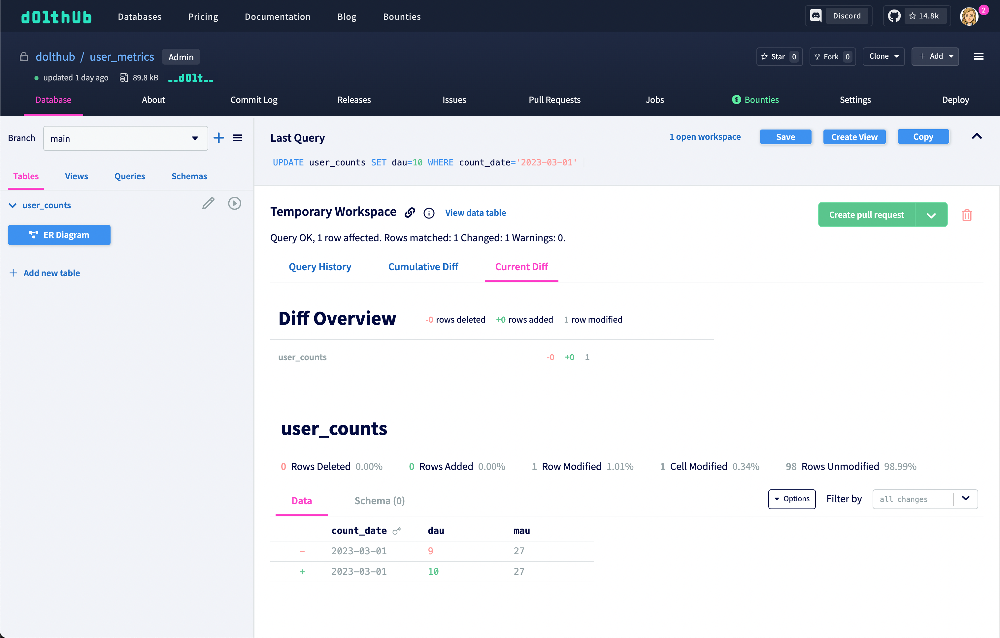
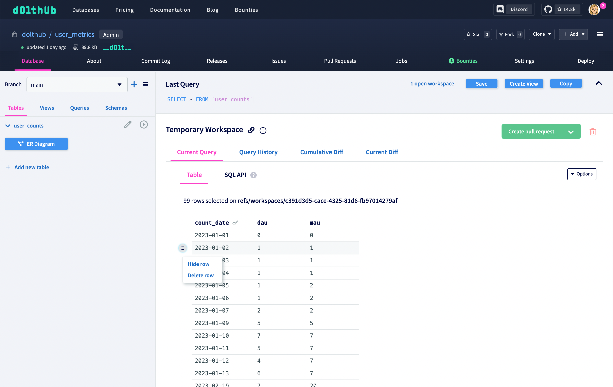
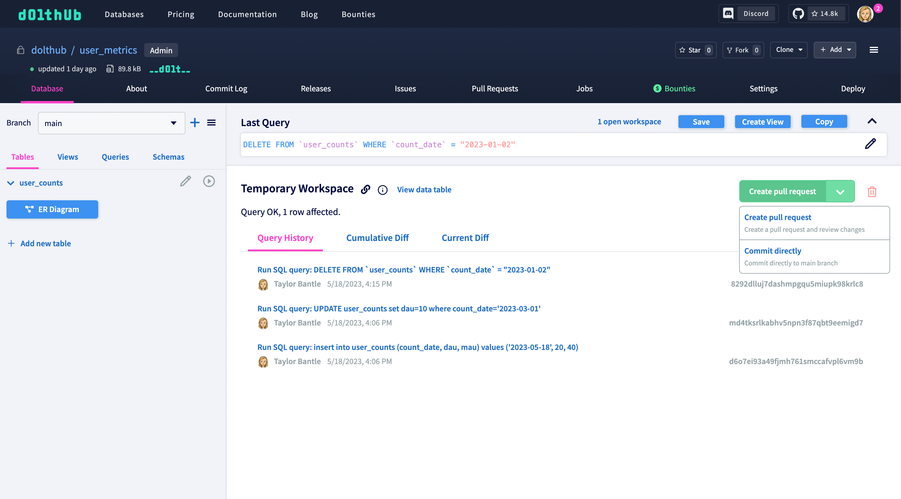
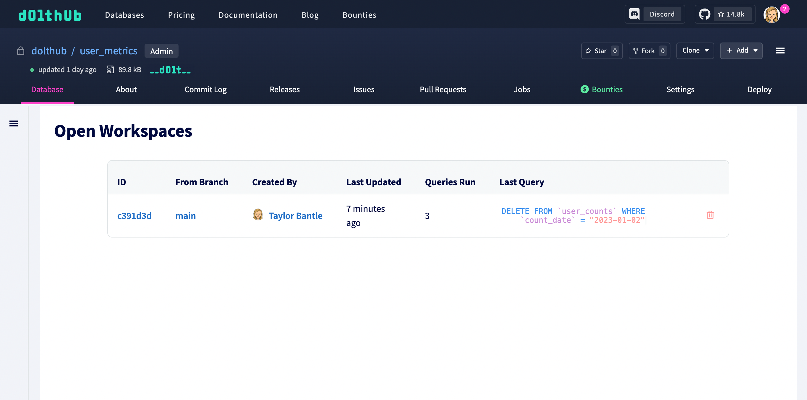

# Workspaces

## What are workspaces?

Workspaces are a concept we invented for editing data on DoltHub. There is not a GitHub equivalent. Essentially workspaces are a special type of ref, similar to [branches](../../concepts/dolt/git/branch.md) or [tags](../../cli-reference/cli.md#dolt-tag). They are meant to simulate a "staging area" on DoltHub, similar to [working sets](../../concepts/dolt/git/working-set.md) in Dolt.

Workspaces are shareable and temporary. Make any change to your database without affecting the state of your database. When you're satisfied with your changes you can commit them to a branch or create a pull request. If you're not satisfied with your changes, you can delete the workspace without any repercussions.

## How are they be used?

Workspaces are automatically created when you run a write query from the SQL Console on a DoltHub database page.

You immediately see the history of queries that have been run within the workspace. From here, there are a few actions you can take:

1. View the cumulative and current diffs

The Cumulative Diff tab shows all changes made to the workspace since it was created from the `main` branch (also known as a [three dot diff](https://www.dolthub.com/blog/2022-11-11-two-and-three-dot-diff-and-log/#three-dot-diff) between `main` and the tip of the workspace).

The Current Diff tab shows the change from the most recent commit on the workspace (or the [two dot diff](https://www.dolthub.com/blog/2022-11-11-two-and-three-dot-diff-and-log/#two-dot-diff) between HEAD and its parent).

Diffs are useful for seeing exactly how your queries affected your data.

2. Run more queries

Any query run from the SQL Console within the workspace will be added to the workspace. You can also view the data table from within the workspace (by running a `SELECT` query or clicking the "View data table" button) to use cell buttons to make changes.

3. Delete the workspace

Clicking on the trash icon on the top right in your workspace will delete it and your changes. This will have no consequences to the rest of your database.

4. Create a pull request or commit

Either create a [pull request](../../concepts/dolthub/prs.md) from the workspace by clicking on the "Create pull request" button, or click on the arrow to change the button to "Commit directly" to create a [commit](../../concepts/dolt/git/commits.md) on the `main` branch (or whatever branch you created the workspace from).

5. Come back to the workspace later

If you don't want to decide right away what you want to do with your workspace, you can come back to it later by clicking on "1 open workspace" at the top of the SQL Console.

You can also share the workspace link with teammates and have them contribute to your workspace.
