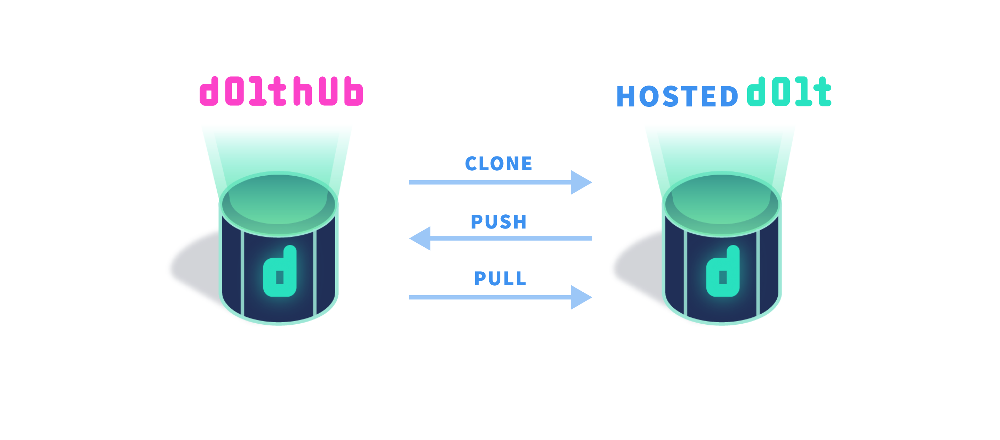
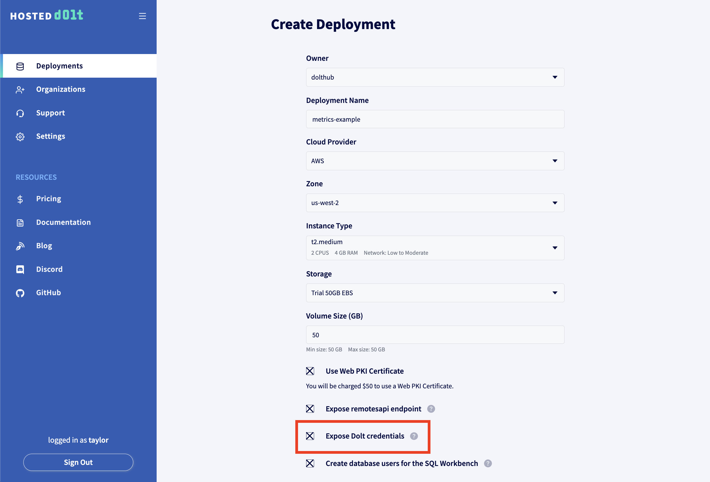
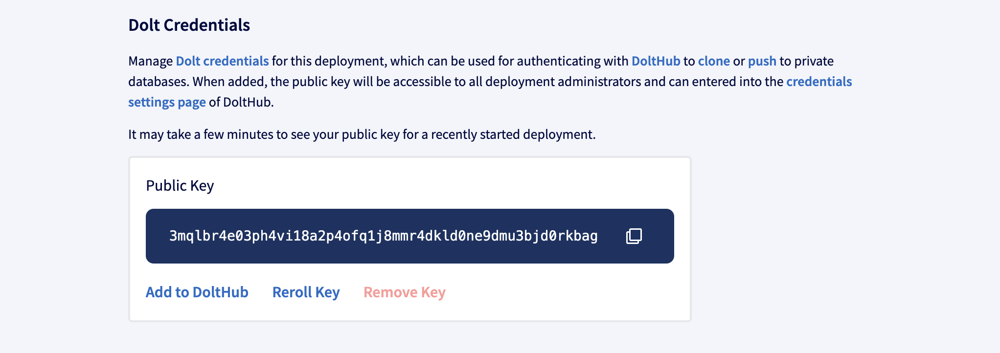
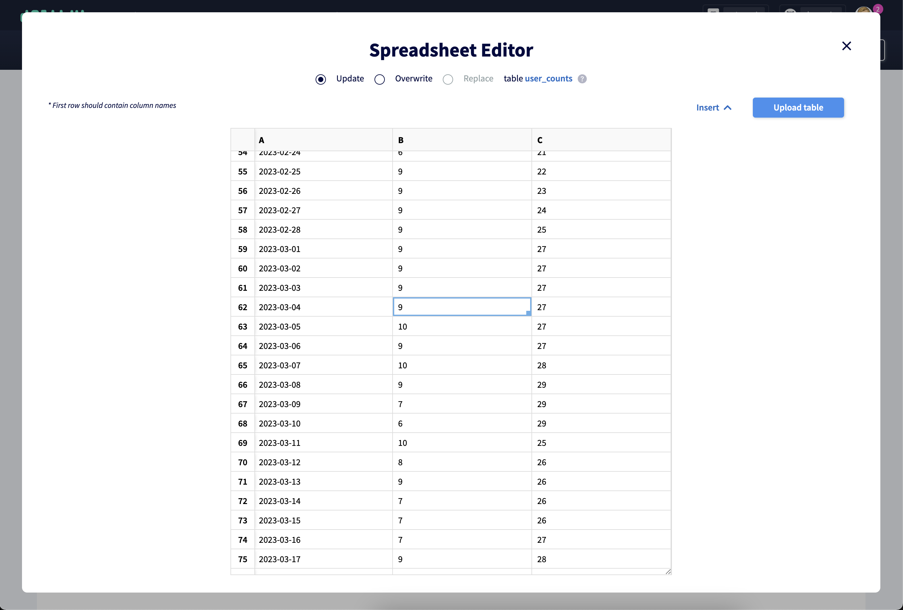
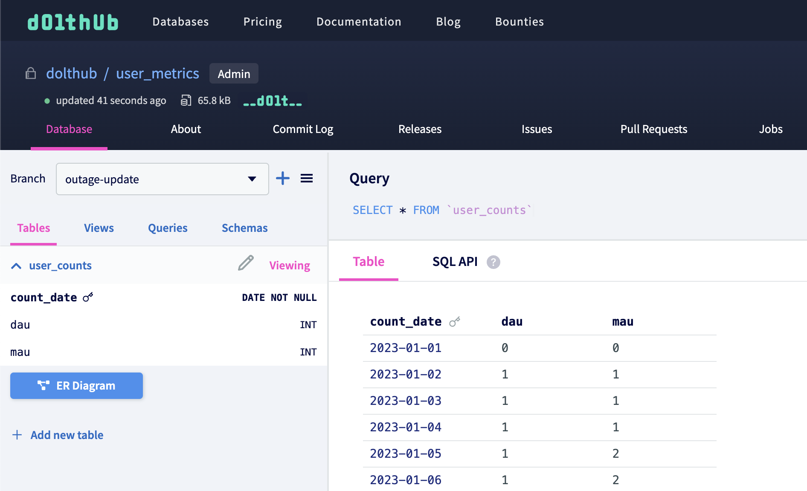

To interact with DoltHub from your Hosted instance, you can use DoltHub as a
[remote](../../concepts/dolt/git/remotes.md). We have [SQL
remote](https://www.dolthub.com/blog/2021-09-22-sql-remotes) operations such as
`dolt_clone`, `dolt_pull`, and `dolt_push` that let you interact with remotes using SQL.
You can add Dolt credentials to your Hosted instance to authenticate certain operations,
like cloning a private database from DoltHub or pushing changes to a DoltHub database you
have write permissions to.

Hosted and DoltHub have different [use cases](https://www.dolthub.com/compare) depending
on your goals, but there are also reasons to use DoltHub and Hosted together. Easily build
an online application based on a [crowd-sourced database](https://dolthub.com/bounties) on
DoltHub or isolate changes to your production database and sync on your schedule.

# How Dolt credentials work on Hosted

When you use Dolt on the [command line](../../reference/cli.md) to interact with DoltHub
or DoltLab to pull private databases or push to databases you have permission to, you're
required to run [`dolt login`](../../reference/cli.md#dolt-login). This creates a new
public/private keypair for authenticating with doltremoteapi and adds it to your global
Dolt configuration. It then opens up your browser to your [credential settings
page](https://www.dolthub.com/settings/credentials) on DoltHub where you can add the
public key.

Since you don't have access to the command line from your Hosted instance, the process for
adding credentials is a little different. When you create a deployment and select "Expose
Dolt credentials" or add credentials to an existing deployment, our [deployment manager
service](https://www.dolthub.com/blog/2022-06-06-hosted-infrastructure#architecture) will
generate Dolt credentials and add them to the global Dolt configuration on your instance.
We store the public key so it is available in the settings tab of your deployment. Once
you add this key to DoltHub, you can use [SQL
remote](https://www.dolthub.com/blog/2021-09-22-sql-remotes) commands to clone, push,
pull, and fetch from public or private databases.



# Example

## 1. Find a database on DoltHub to clone

We have an example user metrics database on DoltHub named `dolthub/user_metrics`. Since we
don't want our metrics to be publicly accessible, the database is private.

We want to host this data on Hosted Dolt so that we can use [Google Looker
Studio](https://lookerstudio.google.com/) to visualize our data. Learn more about that
process [here](https://www.dolthub.com/blog/2023-02-13-dolt-looker/).

## 2. Create a new deployment on Hosted

Next, I create a [new deployment](https://hosted.doltdb.com/create-deployment) on Hosted
and check the `Expose Dolt credentials` check box from the form.



Once the deployment has started, the public key will be populated in the settings tab of
the deployment page (this may take a few minutes). Note that any deployment administrator
will have access to this key.



If I accidentally expose my key or decide I want to remove it, I also have those options
there.

## 3. Add public key to DoltHub

I click on "Add to DoltHub" to add my public key to DoltHub. This will open my DoltHub
[credentials settings page](https://www.dolthub.com/settings/credentials).


## 4. Connect to Hosted instance and clone DoltHub database

Now that I have my credentials set up, I can connect to the Hosted instance using the
information in the Connectivity tab and clone my `dolthub/user_metrics` database.

```sql
% mysql -h"dolthub-metrics-example.dbs.hosted.doltdb.com" -u"[username]" -p"[password]"
mysql: [Warning] Using a password on the command line interface can be insecure.
Welcome to the MySQL monitor.  Commands end with ; or \g.
Your MySQL connection id is 2
Server version: 5.7.9-Vitess

Copyright (c) 2000, 2022, Oracle and/or its affiliates.

Oracle is a registered trademark of Oracle Corporation and/or its
affiliates. Other names may be trademarks of their respective
owners.

Type 'help;' or '\h' for help. Type '\c' to clear the current input statement.

mysql> call dolt_clone('dolthub/user_metrics');
+--------+
| status |
+--------+
|      0 |
+--------+
1 row in set (0.71 sec)

mysql> show databases;
+--------------------+
| Database           |
+--------------------+
| information_schema |
| mysql              |
| user_metrics       |
+--------------------+
3 rows in set (0.05 sec)

mysql> use user_metrics;
Reading table information for completion of table and column names
You can turn off this feature to get a quicker startup with -A

Database changed
mysql> show tables;
+------------------------+
| Tables_in_user_metrics |
+------------------------+
| user_counts            |
+------------------------+
1 row in set (0.04 sec)
```

Now I can do whatever I want with my metrics data, including following [these
steps](https://www.dolthub.com/blog/2023-02-13-dolt-looker/#create-a-data-source) to
connect my Hosted instance to Looker.

## 5. Make changes to database on DoltHub

Finance reviews our metrics charts and finds a hole in the data suggesting an outage.

Finance decides they want to show estimated metrics for the missing days, but we don't
trust Finance to have direct access to our production database. Instead, they can fill in
the estimated `user_counts` for the missing metrics on DoltHub using the spreadsheet
editor and create a pull request. They don't even need to know SQL!



## 6. Pull new DoltHub branch to Hosted instance for testing

We want to review the new chart from the change before we merge it to `main`. We can pull
that branch to our Hosted instance and use it to [create a new branch in
Looker](https://www.dolthub.com/blog/2023-02-13-dolt-looker/#use-a-branch).

```sql
mysql> call dolt_pull('origin', 'outage-estimates');
+--------------+-----------+
| fast_forward | conflicts |
+--------------+-----------+
|            1 |         0 |
+--------------+-----------+
1 row in set (1.08 sec)

mysql> select * from dolt_diff('main...outage-estimates', 'user_counts');
+---------------+--------+--------+------------------+-------------------------+-----------------+----------+----------+----------------------------------+------------------------+-----------+
| to_count_date | to_dau | to_mau | to_commit        | to_commit_date          | from_count_date | from_dau | from_mau | from_commit                      | from_commit_date       | diff_type |
+---------------+--------+--------+------------------+-------------------------+-----------------+----------+----------+----------------------------------+------------------------+-----------+
| 2023-03-01    |      9 |     27 | outage-estimates | 2023-05-17 00:21:13.635 | 2023-03-01      |        0 |        0 | ufqn61fplkokuthk8fgdf2jgf94kv7mj | 2023-05-17 00:17:48.16 | modified  |
| 2023-03-02    |      9 |     27 | outage-estimates | 2023-05-17 00:21:13.635 | 2023-03-02      |        0 |        0 | ufqn61fplkokuthk8fgdf2jgf94kv7mj | 2023-05-17 00:17:48.16 | modified  |
| 2023-03-03    |      9 |     27 | outage-estimates | 2023-05-17 00:21:13.635 | 2023-03-03      |        0 |        0 | ufqn61fplkokuthk8fgdf2jgf94kv7mj | 2023-05-17 00:17:48.16 | modified  |
| 2023-03-04    |      9 |     27 | outage-estimates | 2023-05-17 00:21:13.635 | 2023-03-04      |        0 |        0 | ufqn61fplkokuthk8fgdf2jgf94kv7mj | 2023-05-17 00:17:48.16 | modified  |
+---------------+--------+--------+------------------+-------------------------+-----------------+----------+----------+----------------------------------+------------------------+-----------+
4 rows in set (0.05 sec)

```

## 7. Make a change from Hosted and push it back to DoltHub

We are mostly satisfied with the new chart, but I want to make a small update to the
metrics for one of the days. I can make the change from Hosted on a branch and push it
back to DoltHub using `dolt_push`.

```sql
mysql> call dolt_checkout('-b', 'outage-update');
+--------+
| status |
+--------+
|      0 |
+--------+
1 row in set (0.05 sec)

mysql> update user_counts set dau=10 where count_date='2023-03-01';
Query OK, 1 row affected (0.13 sec)
Rows matched: 1  Changed: 1  Warnings: 0

mysql> call dolt_commit('-am', 'Update DAU estimate for 2023-03-01');
+----------------------------------+
| hash                             |
+----------------------------------+
| h3q00k0ej2uvrcgube0ue7ck27lsfms8 |
+----------------------------------+
1 row in set (0.05 sec)

mysql> call dolt_push('origin', 'outage-update');
+---------+
| success |
+---------+
|       1 |
+---------+
1 row in set (2.47 sec)
```

I will see the new branch in my database on DoltHub.



## 8. Merge branches into `main` on DoltHub and pull again to Hosted

From there, our changes are approved and merged into the `main` branch on DoltHub. One
more `dolt_pull` will update our `main` branch on Hosted.

```sql
mysql> call dolt_pull('origin', 'main');
+--------------+-----------+
| fast_forward | conflicts |
+--------------+-----------+
|            1 |         0 |
+--------------+-----------+
1 row in set (1.44 sec)

mysql> select * from dolt_log as of 'main';
+----------------------------------+-----------+---------------------+-------------------------+----------------------------------------------------------------------------+
| commit_hash                      | committer | email               | date                    | message                                                                    |
+----------------------------------+-----------+---------------------+-------------------------+----------------------------------------------------------------------------+
| h3q00k0ej2uvrcgube0ue7ck27lsfms8 | taylor    | taylor@dolthub.com  | 2023-05-17 00:34:57.659 | Update DAU estimate for 2023-03-01                                         |
| 20hrgf4mh8qq2naeq56ofpojlvpk6o7c | finance   | finance@dolthub.com | 2023-05-17 00:21:13.635 | Fill in estimated user DAU and MAU for outage                              |
| 0os9q2pu14od0ms1hick3ridmtjth0at | timsehn   | tim@dolthub.com     | 2023-01-27 00:54:17.634 | Simulated metrics outage                                                   |
| 5jsvf0vlpeb0bp60iuoo20hvtsc34ipn | timsehn   | tim@dolthub.com     | 2023-01-27 00:50:49.836 | Base generated data                                                        |
| ikfqomtfnrt0b428pjt5n8v02fq9st6m | timsehn   | tim@dolthub.com     | 2023-01-23 20:43:02.062 | New data                                                                   |
| tiu5jb99mrqt8k059gvdvphss76kmeo2 | timsehn   | tim@dolthub.com     | 2023-01-23 19:49:57.939 | Made table with a single row                                               |
| lvp259t93l6jjjvup7nhu29je1lvlto9 | timsehn   | tim@dolthub.com     | 2023-01-23 19:47:52.786 | Initialize data repository                                                 |
+----------------------------------+-----------+---------------------+-------------------------+----------------------------------------------------------------------------+
```
