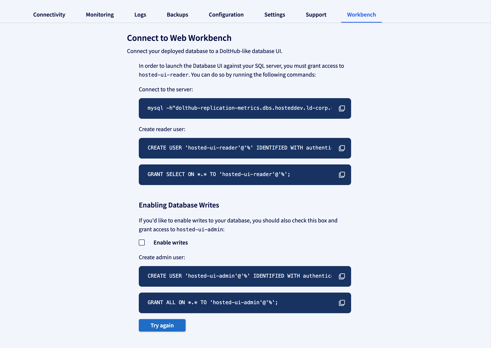
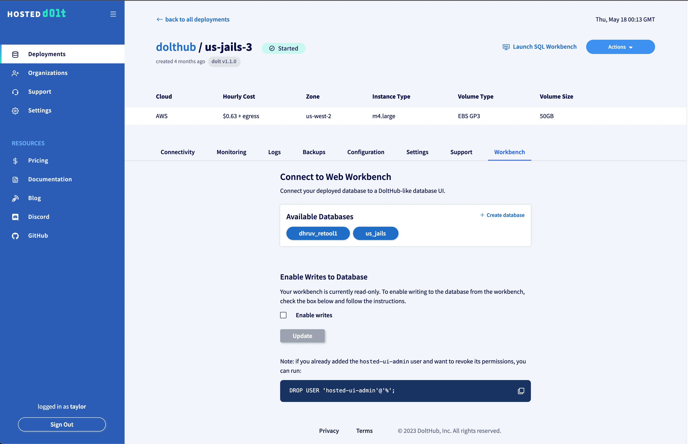
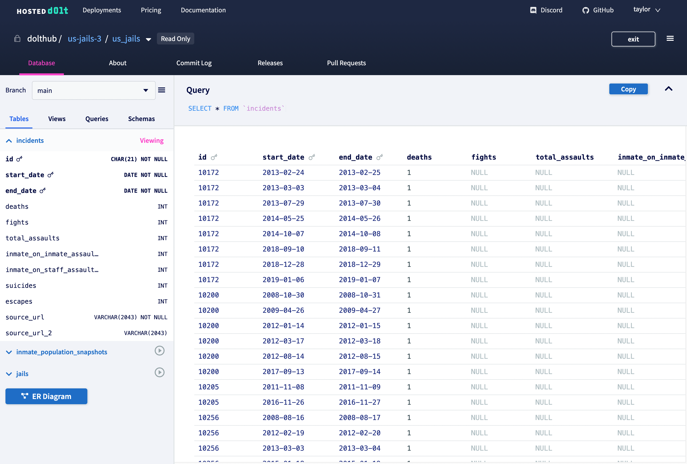
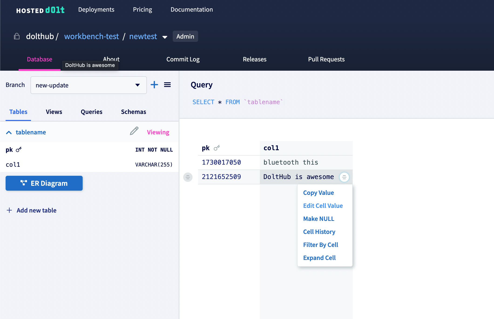
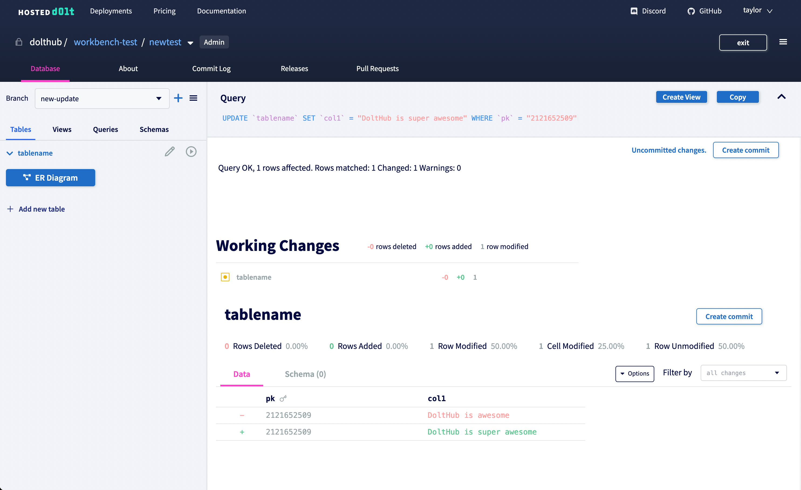
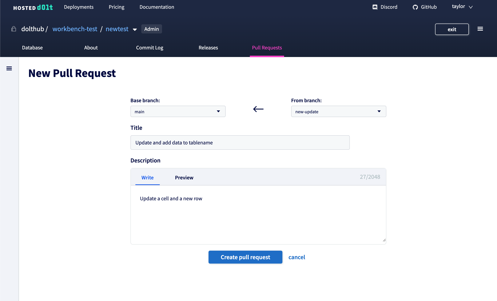
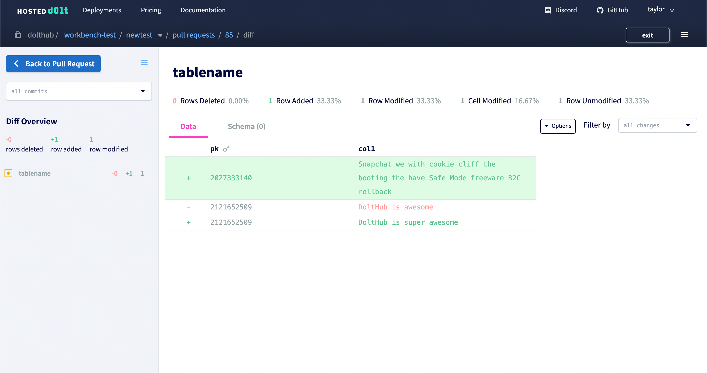
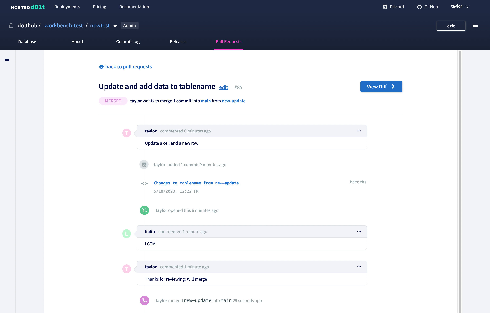

Hosted Dolt has a built-in SQL Workbench with a [DoltHub](https://www.dolthub.com)-like
UI. This allows users to browse their data, as well as utilize Dolt's powerful version
control features like diffs and commit logs. When you enable writes, you can also access
the same features on the Hosted Workbench that make DoltHub easy to use as a collaboration
tool among users of varying levels of SQL and Git knowledge, including cell buttons and
pull requests.

# Getting started with the workbench

It's easy to get started browsing and updating data in your Hosted database with the SQL
Workbench for both new and existing deployments.

1. Add the workbench database users

You must give access to certain database users in order to use the workbench. You can learn more about our workbench authentication model [here](#authentication-model).

For new deployments, this is as simple as checking the "Create database users for the SQL
Workbench" checkbox in the Create Deployment form.


If you create a deployment without checking that box, you can find instructions for adding
the users manually in the Workbench tab of your deployment.



2. Accessing the read-only workbench

The workbench is read-only by default. If the `hosted-ui-reader` user exists and you have
at least one database, you should see the database(s) in the "Available Databases" section
of your Workbench tab, as well as the "Launch SQL Workbench" button at the top.



You can then click on either button to browse your database in read-only mode.



3. Enabling writes

All you need to do to enable writes is to check the "Enable writes" checkbox in the
Workbench tab of your deployment page and click Update. Assuming the `hosted-ui-admin`
user has already been added, you will be able to immediately make changes to your data
using the workbench.

4. Making a change using the workbench

You can make changes to your data using the workbench using the SQL console or cell
buttons. The cell buttons are a beginner-friendly way to make updates.

First, create a new branch. Changes from the workbench are reflected immediately in your
database, unlike DoltHub where you need to manually update your local Dolt with any
changes using `dolt pull`. Creating changes on a branch lets you test a change without
affecting `main`.


Next, use the "Edit cell value" cell button to change a cell.



This will open a text input where you can make changes. Once you're done, click the check.


This will generate a SQL update query. You don't need to know SQL to make updates using
the workbench, but it can help you learn SQL along the way!



DoltHub uses
[workspaces](https://www.dolthub.com/blog/2021-08-04-edit-on-the-web-redux/#edit-using-the-sql-console)
to stage changes made from the web and creates a commit on the workspace for each executed
SQL query. Hosted works more like Dolt where each change is added to the [working
set](../../concepts/dolt/git/working-set.md). When there are uncommitted changes you'll
see the link to the diff with the option to create a commit.

You can make as many changes as you want to the new branch before committing. Adding a new
row is also simple using the `Add a row` button at the bottom of the screen. When you're
done making changes create a commit on your branch.


You will now see a commit for this change in the Commit Log for the branch.


5. Creating a pull request

Now create a [pull request](../../concepts/dolthub/prs.md) to submit your change for
review. Navigate to the Pull Requests tab and click on "Create Pull Request". Choose the
new branch you just updated as the "From branch" and add a title and description.



The pull request will look like this.


And you can click "View diff" to see a detailed view of the proposed changes.



Send this pull request to some teammates and they can comment to request changes or
approve. Once approved, merge your branch.



You will see the new commit reflected in the Commit Log for the `main` branch, as well as
in any connected MySQL client.

# The Hosted Workbench vs DoltHub

There are two ways to use Dolt. You can run Dolt offline, treating data and schema like
source code in the same way you'd use Git. Or you can run Dolt online, like you would
[PostgreSQL](https://www.postgresql.org/) or [MySQL](https://www.mysql.com/). DoltHub,
similar to GitHub, is for collaborating offline on Dolt databases, while Hosted is for
running online production databases.

DoltHub is a hosted Dolt [remote](https://docs.dolthub.com/concepts/dolt/git/remotes). It
uses `doltremoteapi`, a service that wraps Dolt's storage layer's interface, which allows
the website to interact with Dolt databases that are stored in AWS S3. When you view a
page on DoltHub, its API asks `doltremoteapi` for its storage layer interface, and uses
that to query Dolt data. When you make a change on DoltHub it's not automatically
reflected in other remotes. You must use `clone`, `push`, `pull`, or `fetch` to sync
different copies of your database.

Hosted is a cloud-hosted, running Dolt database that you can connect to with any MySQL
client over the internet. The SQL workbench on Hosted uses a [Node.js MySQL
client](https://github.com/sidorares/node-mysql2) to connect to a deployment's running SQL
server, utilizing Dolt's [SQL version control
features](https://docs.dolthub.com/sql-reference/version-control) to display data in a
similar to way to DoltHub. But unlike DoltHub, changes you make from a connected client
are reflected immediately in other clients without any manual syncing.

# Implementation Notes

## Authentication model

In order to implement the database workbench, we needed some API machinery to
access the SQL server running on a deployed hosted instance, and we needed the API to
authenticate to the SQL server. Before this feature, Dolt only supported username/password
authentication.

One way we could have handled this was to deploy the Hosted instances with a
pre-configured username and password, which the API could use to access the database.
However, these credentials would have been harder to make short lived and access to the
database with the credentials would not have necessarily come with progeny information.

Instead, we built an authentication mechanism into Dolt which allows user accounts to
authenticate using signed JWTs. In turn, our Hosted API was extended to issue signed JWTs
for accessing either the read-only account associated with UI (`hosted-ui-reader`) or the
admin account (`hosted-ui-admin`), which is available to deployment admins when writes are
enabled. When someone attempts to connect to the Hosted SQL server, the GraphQL server
calls Hosted API to get short-term credentials, and then connects to the Hosted SQL server
using them.

The JWT-based authentication scheme has the following properties:

1. Credentials are non-forgeable.
2. Credentials are short-lived.
3. Credential creation and use is auditable – logs can record when they are minted, as a result of which requests, and when they are used.
4. Users can configure if these credentials are allowed and for which accounts.

## How it was built

The Hosted SQL workbench is modeled after the DoltHub database page. Similar to the Hosted
website, the DoltHub website is a [Next.js](https://nextjs.org/) application that
communicates with a [GraphQL](https://graphql.org/) server, which provides a translation
layer for DoltHub API. DoltHub API is a Golang service providing [GRPC](https://grpc.io/)
endpoints which drive the website.

Before we started this project we discussed whether we should create a React component
library that we can share between Hosted and DoltHub. Most of the original UI for the
Hosted workbench was going to be the same as the DoltHub database page. We ultimately
prioritized time and decided to hard-fork the DoltHub components to use for the Hosted
workbench. As the Hosted Workbench has developed [away from
DoltHub](https://www.dolthub.com/blog/2023-03-17-dolthub-vs-hosted-workbench) to better
accommodate the features of an online product, this has proven to be the right decision.
Once a month we manually update the Hosted Workbench with any new DoltHub features.

To make that process easier, we wanted to maintain the same GraphQL schema for the queries
used for DoltHub and Hosted. Unlike DoltHub's GraphQL server which gets database metadata
from our DoltHub API services, our Hosted GraphQL server would directly communicate with
the SQL server running on the Hosted instance. While the structure of the requests and
returned objects would be mostly identical, the rest of logic for the UI needed to be
rewritten. The Hosted GraphQL server needed a new service that could manage multiple
database connections and the database metadata query logic needed to be written in SQL
using [Dolt system
tables](https://docs.dolthub.com/sql-reference/version-control/dolt-system-tables) and
[functions](https://docs.dolthub.com/sql-reference/version-control/dolt-sql-functions).

### Comparing DoltHub and Hosted GraphQL servers

Both DoltHub and the Hosted SQL workbench have this dropdown that lists the database
branches. I'm going to use it as a simple example to convey the changes that needed to be
made to implement the DoltHub UI against the Hosted SQL servers.


The `ListBranchNames` query is straightforward. You give it the owner and database names
and it returns a list of all the branches in the database as strings. On DoltHub,
`ListBranchNames` is a GRPC endpoint that communicates with DoltHub API (a Golang service)
to get branch names from the Dolt storage layer, also called a `ChunkStore`, which is
stored in AWS S3. This service first validates the request to ensure the calling user has
permission to see the database and that the database exists on DoltHub. It then uses the
read-only chunk store interface to query Dolt for the branch data. This looks something
like:

```go
func (impl *repositoryDataUseCaseImpl) ListBranchRefs(ctx context.Context, owner, repoName string) ([]ref.DoltRef, error) {
  cs, sizer, err := impl.csFactory(ctx, owner, repoName, true)
	if err != nil {
		return nil, err
	}

	readOnlyCs := dhdolt.NewReadOnlyChunkStore(cs)
	doltDatabase := &DoltDatabase{doltdb.DoltDBFromCS(readOnlyCs), readOnlyCs, sizer, owner, repoName}

	branchRefs, err := doltDatabase.GetBranches(ctx)
	if err != nil {
		return nil, err
	}

	return branchRefs, nil
}
```

In our DoltHub GraphQL server, we have a [branch
resolver](https://www.apollographql.com/docs/apollo-server/data/resolvers) (we use
[Apollo](https://www.apollographql.com/) to build our GraphQL server in Typescript) that
uses this GRPC endpoint to get the branch names:

```ts
  @Query(_returns => BranchNamesList)
  async branchNames(
    @Context() context,
    @Args() args: RepoArgs,
  ): Promise<BranchNamesList> {
    const api = this.apiProvider.getClient(context);
    const req = new ListBranchNamesRequest();
    req.setRepositoryName(RepositoryUtils.rn.fromParams(args));
    const res = await api.listBranchNames(req);
    return { list: res.getBranchNamesList() };
  }
```

Since we need to communicate directly with the SQL server to list the branches for the
Hosted SQL workbench, the resolver looks different (we use [typeorm](https://typeorm.io/)
with Apollo in Hosted GraphQL server). We need to first get the correct database connection,
grab a connection from the connection pool, and then use the [`dolt_branches` system
table](https://docs.dolthub.com/sql-reference/version-control/dolt-system-tables#dolt_branches)
to get the branch names.

```ts
  @Query(_returns => BranchNamesList)
  async branchNames(
    @Context() context,
    @Args() args: RepoArgs,
  ): Promise<BranchNamesList> {
    // Gets (or adds if doesn't exist) the database connection
    const conn = await this.dbConnect.connection(context, args);
    // Takes a single connection from the connection pool
    const queryRunner = conn.dataSource.createQueryRunner();
    await queryRunner.connect();
    const branches = await queryRunner.query("SELECT * FROM dolt_branches");
    await queryRunner.release();
    return {
      list: branches.map(b => b.name),
    };
  }
```

This process is similar for querying other database metadata, but unlike branches which are not revision-dependent, metadata like tables and commits need to be queried at a certain point in the commit history. We make heavy use of [revision
databases](https://docs.dolthub.com/sql-reference/version-control/querying-history) to
make this work.

For example, to list tables for a branch, we can use an `AS OF` clause: `SHOW TABLES AS OF 'feature_branch'`. Or for user-run SQL queries we can use a `USE` statement to specify the branch before the query is run, like:

```sql
USE `museum-collections/main`;
SELECT * FROM objects WHERE category="drawing";
```

# Additional Resources

Here are some blogs that go more into depth about the SQL Workbench on Hosted:

- [Announcing the build-in SQL Workbench](https://www.dolthub.com/blog/2022-08-24-hosted-sql-workbench/)
- [Allowing writes on the SQL Workbench](https://www.dolthub.com/blog/2022-09-26-hosted-ui-writes/)
- [Comparing DoltHub and the Hosted SQL Workbench](https://www.dolthub.com/blog/2023-03-17-dolthub-vs-hosted-workbench/)
