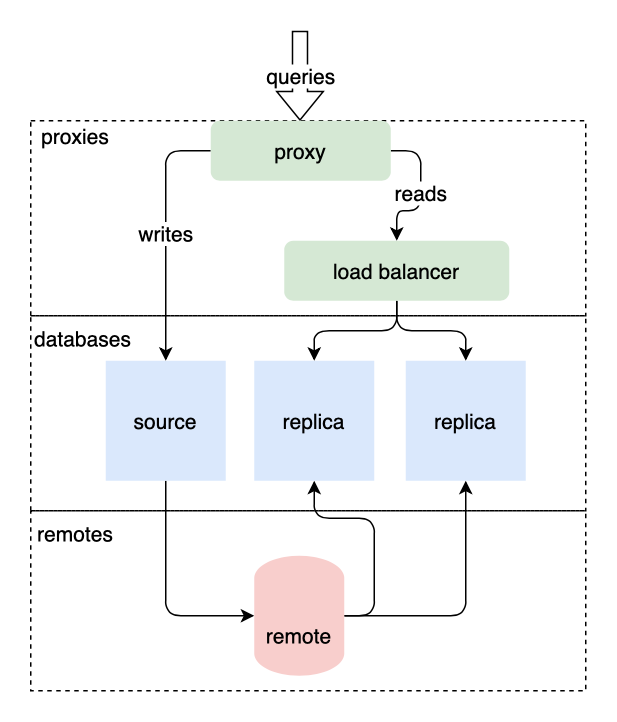

Overview:

- [Backups](#backups)
- [Read Replication](#read-replication)
- [Failover](#failover)
- [Multi-Master](#multi-master)

In the context of an OLTP database, availability is the ability
to tolerate and recover from server failures. Durability and storing backups of
data are basic prerequisites of availability. The more useful version
of availability involves servers communicating changes with one another,
load balancing read requests, and maintaining a responsive application
when servers fail.

## Backups

Dolt has two options for backup: remotes and backups.

Using remotes for backups should be suitable for some use cases. Pushing
to a remote creates an off server copy of the branch being pushed.
Frequently pushing to a remote can serve as a reasonable backup.

Dolt also has backups, accessed with the `dolt backup` command. These backups
look more like traditional database backups. The entire state of the
database, including uncommitted changes, are copied to another location.

Refer to the [cli
documentation](https://docs.dolthub.com/interfaces/cli#dolt-backup) and
the [backups blog](https://www.dolthub.com/blog/2021-10-08-backups/) for
a more thorough introduction.

## Read Replication

Replicating data between servers can increase your application's read query
throughput. If a read replica fails, your application is
still available. If a replication source fails, that is a bigger
problem that requires a [failover](#failover) solution.

Dolt supports simple read replication with two caveats:

- A remote is a replication middleman.

- Individual transactions are _not_ replicated, only commits.

In summary, we support replicating a source database by pushing
on commit, and pulling to replicas on read. The stability of middleman is
required to maintain a line of communication between the primary server
and its replicas.

Refer to the [read replication
blog](https://www.dolthub.com/blog/2021-10-20-read-replication/) for more details.

## Failover

If the primary database processing writes
fails, queries will either need to be routed to a standby server, or
queue/fail until the primary restarts. We do not have a purpose-built
solution or documentation for failover recovery yet.

In the meantime, it is possible to use push/pull replication to maintain
a standby server. If the primary server fails, the standby and proxy
would need to walk through a series of steps to create a new primary:

- Standby server disables read-only mode if it was used as a read
    replica previously.

- Standby server recovers the most recent transactions, either from the
    remote middleman or a primary backup.

- Standby sets the replication source configuration to push on write.

- Proxy layer directs write queries to the formerly standby, now primary
    server.

## Multi-Master

We do not have specific solutions or documentation to run Dolt as
an OLTP database with multiple masters. It is possible to connect several
write target with a common remote middleman, but they would need to reconcile
merge conflicts in the same way an offline Dolt database does. Providing
a transactional layer to enforce multi-master (to avoid merge conflicts)
or a way to automatically resolve merge conflicts is necessary to run
Dolt as a multi-master database effectively.
