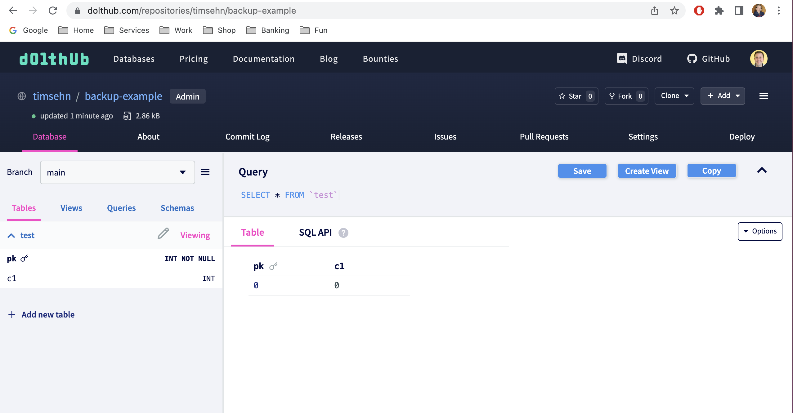

# Backups

Dolt has two options for [backups](../../../concepts/dolt/rdbms/backups.md): remotes and backups.

## Remotes

Using remotes for backups should be suitable for some use cases. Using remotes for backups only backs up to the current commit of a branch, not the working set. Pushing to a remote creates an off server copy of the branch being pushed. Frequently pushing to a remote can serve as a reasonable backup.

### Configure a remote

Currently you can only add and remove remotes from the [Dolt CLI](../../cli.md). The example uses DoltHub as a remote but you can use Dolt with [other remotes like filesystem, AWS S3, and GCS](https://www.dolthub.com/blog/2021-07-19-remotes/). I created an empty database on DoltHub and [configured the appropriate read and write credentials on this host](../../../introduction/getting-started/data-sharing.md#dolt-login).

```bash
% dolt remote add backup https://doltremoteapi.dolthub.com/timsehn/backup-example
$ dolt remote -v
backup https://doltremoteapi.dolthub.com/timsehn/backup-example 
```

### Backup by Pushing a Branch

```sql
mysql> use backup_example;
mysql> create table test (pk int, c1 int, primary key(pk));
mysql> insert into test values (0,0);
mysql> call dolt_add('test');    
mysql> call dolt_commit('-m', "Created table and inserted values to be backed up");
+----------------------------------+
| hash                             |
+----------------------------------+
| slm5cql6ri8l4vd7uemvqhj6p2e2g98k |
+----------------------------------+
mysql> call dolt_push('backup', 'main');
+---------+
| success |
+---------+
| 1       |
+---------+
```

Using DoltHub or DoltLab as a remote provides a web UI to your backups.



## Backups

Dolt also has backups, accessed with the [`dolt backup` command](../../cli.md#dolt-backup). These backups look more like traditional database backups. The entire state of the database, including uncommitted changes on all branches, are copied to another location.

### Create a backup

To create a backup you first configure a backup using syntax similar to the [remote](../../../concepts/dolt/git/remotes.md) syntax.

```bash
$ mkdir -p /Users/timsehn/liquidata/dolt/backups/backup-example
$ dolt backup add local-backup file:///Users/timsehn/liquidata/dolt/backups/backup-example
$ dolt backup sync local-backup
Uploaded 3.1 kB of 3.1 kB @ 0 B/s.
$ 
```

You can use any valid dolt remote, including [AWS S3, GCS](https://www.dolthub.com/blog/2021-07-19-remotes/), and DoltHub remotes. For example, to backup to a DoltHub remote, do something like:

```bash
$ dolt backup add dolthub-backup https://doltremoteapi.dolthub.com/username/my-database-backup
$ dolt backup sync dolthub-backup
```

The repository `username/my-database-backup` will need to have already been created on DoltHub and your dolt CLI will need to be authenticated to write to it.

It's important to note that syncing a backup to a remote will overwrite every existing branch and working set. The state of the remote repository becomes exactly the state of the database which is synced to it. In particular, remote branches will be deleted if they do not exist in the local database and all existing branches are pushed without regard to merged state, whether the push is a fast forward of an existing remote branch, etc. If you want to keep more than one version of a backup, you should use different remote URLs.

Doing a syncing of a backup to an existing backup remote is incremental. It only copies the novel data which has changed since the last sync.

### Sync a backup from SQL

You can use the `dolt_backup` SQL procedure to sync backups from within SQL.

```sql
mysql> use backup_example;
mysql> insert into test values (1,1);
mysql> call dolt_backup('sync', 'local-backup');
+---------+
| success |
+---------+
| 1       |
+---------+
```

### Restore from a backup

The backup command called with the restore option looks a lot like the [dolt clone command](../../cli.md#dolt-clone).

```bash
$ dolt backup restore file:///Users/timsehn/liquidata/dolt/backups/backup-example backup-restore
Downloaded 14 chunks, 3.5 kB @ 0 B/s.

$ cd backup-restore/
backup-restore $ dolt sql -q "select * from test"
+----+----+
| pk | c1 |
+----+----+
| 0  | 0  |
| 1  | 1  |
+----+----+
```

Note the working set changes were also restored.

Configuration and [users/grants](../../../concepts/dolt/sql/users-grants.md) are not backed up and restored as these are not stored in the versioned part of Dolt.

Backups are currently configured on a per-database basis. In a sql-server context with multiple databases, unique backup remotes should be configured for each database and each database should be synced individually.
